# `Maximise Your Productivity With Glasp: A Beginner’s Guide to Using Glasp`

### `Table of Contents`

[What Is Glasp?](#what-is-glasp)

[Why You Should Use Glasp](##why-you-should-use-glasp)

* [Become a Knowledge Curator](#become-a-knowledge-curator)
* [Enhance Online Learning](#enhance-online-learning)
* [Amplifies Content Reach](#amplifies-content-reach)
* [Improve Your Productivity](#improve-your-productivity)
* [Transform Your Research Experience](#transform-your-research-experience)

* [Connect and Share Quotes With Like-Minds](#connect-and-share-quotes-with-like-minds)

* [Friendly User Interface](#friendly-user-interface)

[How to Set Up Glasp](#how-to-set-up-glasp)

* [To Install the Glasp Extension](#to-install-the-glasp-extension)
* [To Sign Up ](#to-sign-up)

[An Overview of the Glasp Dashboard](#an-overview-of-the-glasp-dashboard)

* [User Profile](#user-profile)
* [Heat Map](#heat-map)
* [Tags](#tags)
* [Atomic Graph](#atomic-graph)
* [The Navigation Tabs](#the-navigation-tabs)
* [The Highlight Tab](#the-highlight-tab)
* [Add Highlight to Favourite](#add-highlight-to-favourite)
* [Copy Your Highlights](#copy-your-highlights)
* [Share Your Highlight](#share-your-highlight)
* [Deleting Highlights](#deleting-highlights)
* [Add a Tag to Your Highlights](#add-a-tag-to-your-highlights)
* [Add Author to Your Highlights](#add-author-to-your-highlights)
* [AI Summary](#ai-summary)
* [Add Your Comment and Thoughts to Your Highlight](#add-your-comment-and-thoughts-to-your-highlight)

[How to Use Glasp](#how-to-use-glasp)

* [Customise Your Account Based on Your Preferred Topics](#customise-your-account-based-on-your-preferred-topics)
* [Highlighting Text Online](#highlighting-text-online)
* [Highlight YouTube Videos](#highlight-youtube-videos)
* [Sharing Highlights With Note-Taking Applications](#sharing-highlights-with-note-taking-applications)

[How to Get the Best Out of Glasp](#how-to-get-the-best-out-of-glasp)

[Conclusion](#conclusion)

---

As we read content online for research, study, or casual reading, we read people’s stories, learn from them, and get inspired. These findings from our online experience equip us with knowledge. But sometimes, it could be working in futility since we can easily lose touch with this knowledge or the stories that inspired us. And this is where I introduce Glasp, a social web highlighter that has perfected ways to transform people’s online experience.

Glasp is a productivity app for writers, students, avid readers, and researchers. It gives you the creative freedom to highlight ideas and text in an organised manner so your followers can easily connect with you in real-time through available, visually appealing quotes. Glasp helps you highlight and organise information, then collates them onto your Glasp homepage. You can share your highlights across social media platforms, adding more meaning to your articles or online content. 

## `What Is Glasp?`
Glasp is a social web highlighter that lets you capture online content in a variety of colours, which is then curated to your homepage. With Glasp, you can recapture your highlighted text, search, make notes alongside, and take a quote shot that you can share across other platforms like Twitter, Teams, Slack, and other note-taking applications.
You can add a tag to your highlighted quote using the add tag feature to give each highlight more meaning and context. The add tag feature has a well-functioning sidebar where you can add your thoughts and findings and leave a note alongside the captured quote.

## `Why You Should Use Glasp`
Using Glasp provides many benefits, some of which are highlighted below.

### `Become a Knowledge Curator`
Glasp as a tool provides an environment where you can highlight contents that piques your interest, and these highlights are curated automatically to your Glasp homepage. With Glasp, you can organise ideas, research, quotes, and inspiration on its homepage and use this curated knowledge to spark your creativity.

### `Enhance Online Learning`
Whether you are an avid reader, student, researcher, or just browsing the web searching for information, Glasp has got you covered. Glasp is the best tool to curate knowledge while enjoying online content without distractions, like going to a note-taking app to jot down points or ideas. All you have to do is drag your cursor over the piece of text you want to capture, save it, and get the captured text resurfaced at your convenience.

### `Amplifies Content Reach`
Glasp is like a knowledge box for your online content. It allows you to leverage social media by sharing what you learned, fostering engagement with your post, and motivating your followers through the knowledge you gained from reading or watching online content. It also allows you to keep notes alongside the captured text and use them on your projects and articles or share them on various social media platforms.

### `Improve Your Productivity`
Glasp will transform your learning habits and how you approach information gathering. It eases your learning process and removes the burden of remembering every fact and figure you find online. You can use Glasp's hit map for capturing to keep track of your activities and the knowledge you’ve gathered over a period. You derive pleasure when you log in every day to read topics tailored for you, connect with a community of thinkers, and stay motivated and productive at the same time.

### `Transform Your Research Experience`
You can trust Glasp to aid your research process and you won't be disappointed. Writing a research paper or an article requires that you cite your sources. As you research and read articles online, Glasp will help you organise your findings and what you have learned so you can get back to them later. It takes your mind off how to organize your research findings and keeps you focused on reading and finding information.

### `Connect and Share Quotes With Like-Minds`
Glasp will keep you updated with trends and topics that interest you. When you sign up, you can choose up to ten topics of growth, industry, and career you wish to follow. The highlights from your mutuals will be delivered on your account homepage in a user-friendly manner, allowing you to learn from other knowledge curators. It also comes with some social elements, as you can connect with like-minded people by following each other and sharing knowledge.

### `Friendly User Interface`
People are likely to use software with an impressive design and a good user experience. Glasp is not left behind in this aspect due to its simplicity and flexibility. It's user-friendly, with a fantastic layout and other helpful features that keep users engaged and productive at the same time.

It has a navigation bar that displays your favourite highlights, articles, pages, and authors of the articles. It has a hit map at the left corner showing how many times you captured text over a period, be it weeks or months. You can also search for highlights using the search bar at the top of the homepage.

## `How to Set Up Glasp`
Setting up a Glasp account is painless. To set up a Glasp account, you need to install the Glasp extension on your browser and sign up for an account.

### `To Install the Glasp Extension`
To add the Glasp extension to your browser, take the following steps:
1. Go to the Glasp [website](https://glasp.co). 
2. Choose Chrome or Safari as your preferred browser.
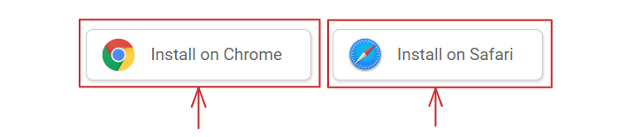
3. Click **Add to Chrome** (or your preferred browser).
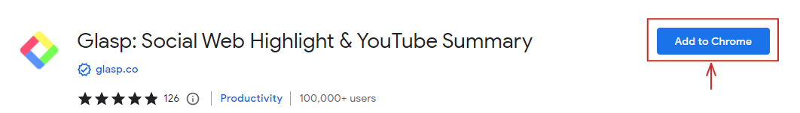
4. Click **Add extension** to install the extension.
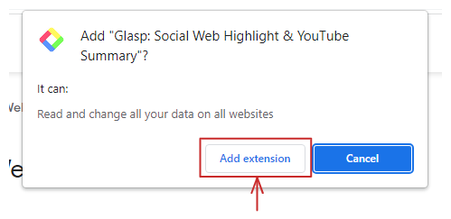
5. You will be redirected to the Glasp homepage to sign up after installation. 

### `To Sign Up `  
To sign up, take the following steps:
1. Click on **Sign up**.
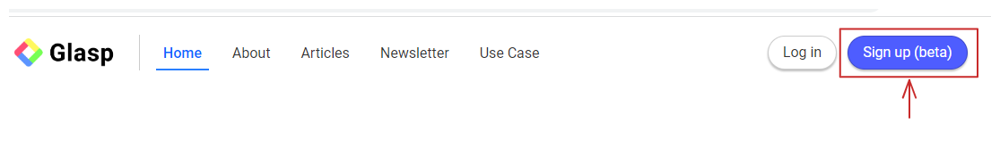
2. Click on **Continue with Google**.
3. Select or input your preferred email address.
4. Confirm your email address to sign up. 

## `An Overview of the Glasp Dashboard`
The Glasp dashboard provides a user-friendly interface to help you organize your highlights and better navigate the application.

### `User Profile`
The user profile houses the accounts you follow, those that follow you, and the date you signed up for Glasp. The user profile section lets you enjoy some social element.

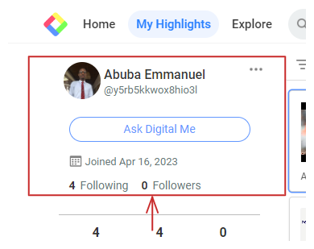

### `Heat Map` 
The heat map shows your highlights across different platforms over time. It helps you track how active you are in learning and curating content. It shows the number of people who viewed your highlight, your number of highlights, and the pages you've highlighted. The green square represents your highlights over time. Clicking on any of the green squares will redirect you to the highlight.
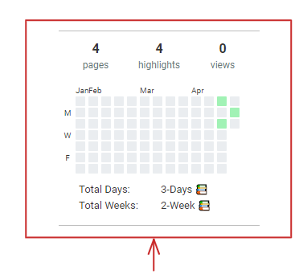

### `Tags` 
Tags add more context and identity to your highlight. For example, if the highlighted article is about modern technologies and artificial intelligence, you can use the tag "AI." All the contents with that tag will appear when you click on AI. It also helps you find related topics easily by clicking on a tag.
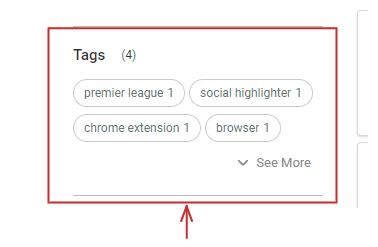

### `Atomic Graph` 
The atomic graph helps you find your highlights easily by searching for highlights with related tags. When you search for a tag, all the articles with that tag will appear.
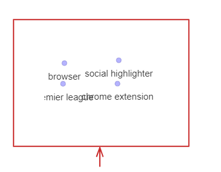

### `The Navigation Tabs` 
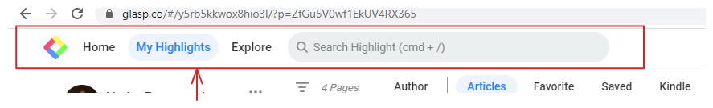
The navigation bar comprises features like `Home`, `My Highlights`, `Explore`, and `Search Bar`.

**Home:** The home page lets you connect with new people, people you follow, and their highlights. You also see community insights and read highlights of topics you chose and find interesting.

**My Highlights:** It makes your profile stand out by showing off your activities, highlights, and other features that will give you a better experience.

**Explore:** Explore helps you find content from the community. In addition, you can search for websites or authors.

**Search Highlight:** The search highlight allows you to search for highlights using any keyword or tags attached to the highlight.

### `The Highlight Tab`
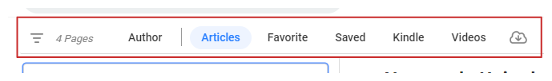
The Highlight Tab comprises features like `Pages`, `Author`, `Articles`, `Favourite`, `Saved`, and `Kindle`. Here is what they do:

**Pages:** The Pages tab shows the number of highlights you’ve made for some time.

**Author:** The Author tab shows the author of the article that was highlighted.

**Articles:** The Article tab shows all the highlights, articles, links, and tags.

**Favourite:** It shows your favourite highlights. You can favourite a highlight by using the star icon at the top right corner.  

**Saved:** This tab is where you save highlights of your friends, people you follow, or  like-minded people.

**Kindle:** This tab allows you to connect and share highlights on Kindle.

**Video:** The video tab shows highlights from videos you curate online.

**Highlight Downloader:** The highlight downloader has a cloud-like shape with a downward-facing arrow inside it. With the highlight downloader, you can download highlights in different file types. For example, you can download highlights as HTML, Markdown, CSV, text, and JSON files.

### `Add Highlight to Favourite`
Adding a highlight to your favourites will help you keep in touch with content you consider important and likely to revisit. Here is how you add highlights to your favourite: 

1. Click on the highlight you want to add to your favourite.
2. Click on the star icon at the top-right corner.
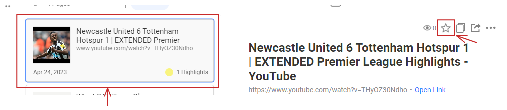

### `Copy Your Highlights`
You can copy highlights and paste them into a note-taking applications and other platforms. To copy highlights, take the following steps:

1. Click on the highlight you want to copy.
2. Click on the square-shaped icon at the top right.

### `Share Your Highlight`
The highlight share feature enables you to reach a larger audience and get people to connect with your highlights. You can share your highlights on `Facebook`, `Twitter`, `LinkedIn`, and `email`. With the highlight share, you can copy the `highlights`’ `link`, export it to `Readwise`, and download highlights' images. Here is how to share your highlight:
1. Click on the highlight you want to share.
2. Click on the square-shaped icon with the arrow facing the right.

### `Deleting Highlights`
You can easily get rid of highlights by deleting the highlight page. To do this:
1. Click on the highlight you want to delete. 
2. Click on the three-dotted icon at the top right corner. 

3. Click on **Delete Page**.

### `Add a Tag to Your Highlights`
Adding tags to your highlights helps you to quickly find highlights with the same tag. To add a tag to your highlight, take the following steps:

1. Click on the highlight you want to add a tag to.
2. Type the tag in the tag bar.
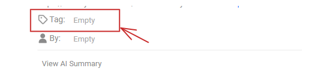
3. Press the enter key on your keyboard.

### `Add Author to Your Highlights`
Every video you watch online has a creator, and the same with articles with authors. You can add authors and creators to your highlights. To add authors to your highlight, take the following steps:

1. Click on the highlight you want to add an author to. 
2. Type the name of the author in the author bar. 
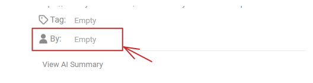
3. Click on the name of the author when it pops up.

### `AI Summary`
The AI summary keeps your highlights concise for easy understanding. To summarise your highlight, take the following steps:

1. Click on the highlight you want to summarise.
2. Click **View AI Summary**.
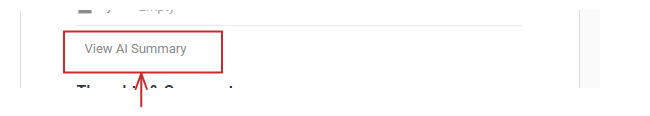

### `Add Your Comment and Thoughts to Your Highlight`
You can add your thoughts and comments to your highlight. Here is how you do it:

1. Click on the highlight you want to add your thoughts or comments to.
2. Type your comments or thoughts in the comment bar.     
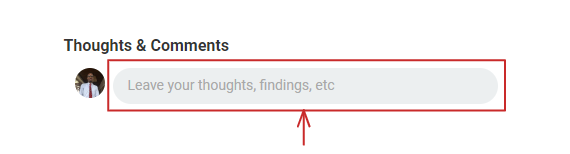
3. Click on **Save** at the top right. 

## `How to Use Glasp `
If you are new to the Glasp extension, follow the guide below to see several use cases and how to use the highlighter for text, videos (YouTube), and note-taking applications.
### `Customise Your Account Based on Your Preferred Topics `
After you sign up, you can customise your account with up to ten topics to choose from. 
Here is how you do it: 

1. A list of topics will pop up when you sign up.
2. Click on your ten preferred topics.
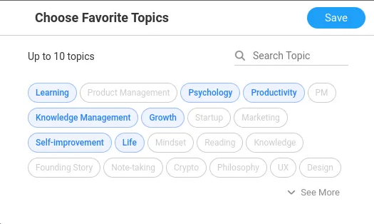
3. Click **Save** at the top right.

Selecting your favourite topics will customise the topics to your profile. The selected topics will appear at the top left corner of your profile page. You can change the selected topics by clicking the more option (...) on the side.

### `Highlighting Text Online`
Once you’ve identified the text on the web you want to highlight, take the following steps:
1. Drag your cursor over the text you want to highlight.
.png)
2. Click on the colour you want to highlight the text with.

After highlighting the text, a sidebar menu will show your highlights on that web page. You can add a note, create a highlight image, leave your thoughts or findings, copy the link to your highlight, and also share your highlight as a quote on Twitter. Click on "Save" after making these updates to your highlight to get them saved to your homepage.

### `Highlight YouTube Videos`
Once you’ve installed the Glasp extension to your browser, you can highlight transcripts of YouTube videos, copy transcripts to a note-taking application, or highlight part of the transcript you find captivating and curate it to your Glasp homepage. 

To highlight a YouTube video transcript, take the following steps:
1. Open YouTube in your browser.
2. Go to the video you want to highlight.
3. Click the downward-facing arrow at the top-right corner to open the transcript.
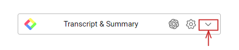
4. Click on the square icon at the top-right corner to copy the transcript.  
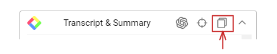

You can highlight the YouTube transcript with the four-colour option, add notes, leave comments and share the highlight with other social platforms.

### `Sharing Highlights With Note-Taking Applications`
You can copy highlights from articles or videos and paste them into a note-taking applications like Evernote, Notion, etc. To do this:
1. Click on the article you want to copy.
2. Click on the square-shaped icon to copy the highlight.

3. Paste the article into your preferred note-taking application.

## `How to Get the Best Out of Glasp`
Glasp is a free social highlighter that helps you organise content, thoughts, and inspiration online. Even though it is straightforward, there are guidelines to get the best results from the application. 

**Add Comments to Your Highlight:** Adding comments to your highlight will give your readers an insight into your opinion about the article or the video you’ve curated. Your comments will also drive conversation and engagement from like-minded people.

**Add Tags to Your Yighlight:** Adding tags will help you navigate Glasp easily. It makes it easy to find highlights by searching for the tag name in the search bar.

**Each Highlight Should Include Authors:** To aid readers and researchers, appending an author to a highlight gives a more beneficial research result; it also helps you cite articles and content, and provide backup to the source of your knowledge.

**Add a Note to Your highlight:** Including a note in your highlight will help you craft a summary for the article you are highlighting and add more meaning and clarity to your highlights.

**Join the Glasp Community:** Joining the Glasp community will provide you with the needed support to learn better and access what your friends are reading and learning. The community connects you with like-minded people to share ideas with and learn from what they share.

## `Conclusion`
Glasp has continued to gain traction since its launch. The Glasp extension has become a go-to tool for productivity enthusiasts and readers who want to organise and manage knowledge. The extension enables you to learn from others while you collect your notes, which you can access easily. Glasp will boost your productivity, keep you informed, and help you share your thoughts with friends, colleagues, and other users.   

The Glasp extension is free to use. It’s available for Chrome and Safari browsers. Join Glasp today and become a pro at managing and organising your content. Create a free [Glasp account](https://glasp.co) and get started!

